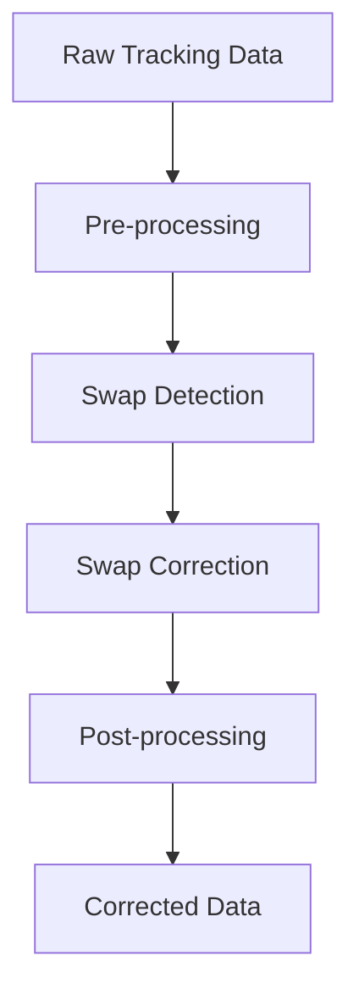
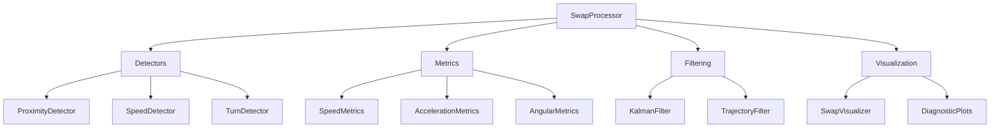

# System Architecture

## Overview

The Swap Correction system is designed as a modular pipeline for detecting and correcting head-tail swaps in animal tracking data. The architecture follows a component-based design with clear separation of concerns and extensible interfaces.

## Core Components

### 1. Data Pipeline

### 2. Component Architecture

## Component Details

### 1. SwapProcessor

The main orchestrator of the swap correction pipeline.

- **Responsibilities**:
  - Coordinate detection and correction
  - Manage component lifecycle
  - Handle configuration
  - Process data in batches

- **Key Methods**:
  - `process()`: Main processing pipeline
  - `detect_swaps()`: Swap detection
  - `correct_swaps()`: Swap correction
  - `validate_corrections()`: Correction validation

### 2. Detectors

Specialized components for detecting different types of swaps.

- **BaseDetector**:
  - Abstract base class
  - Common detection interface
  - Configuration management

- **Specialized Detectors**:
  - ProximityDetector: Close proximity swaps
  - SpeedDetector: High-speed swaps
  - TurnDetector: Turn-based swaps

### 3. Metrics

Calculation of movement metrics for detection.

- **Speed Metrics**:
  - Linear speed
  - Angular speed
  - Acceleration

- **Path Metrics**:
  - Curvature
  - Tortuosity
  - Turning radius

### 4. Filtering

Data preprocessing and postprocessing.

- **KalmanFilter**:
  - State estimation
  - Prediction
  - Smoothing

- **TrajectoryFilter**:
  - Noise reduction
  - Gap filling
  - Outlier removal

### 5. Visualization

Tools for analysis and debugging.

- **SwapVisualizer**:
  - Trajectory plots
  - Metric plots
  - Swap highlighting

- **DiagnosticPlots**:
  - Performance metrics
  - Detection statistics
  - Correction validation

## Data Flow

1. **Input Data**:
   - Raw tracking coordinates
   - Timestamps
   - Metadata

2. **Processing**:
   - Pre-processing filtering
   - Metric calculation
   - Swap detection
   - Correction application
   - Post-processing filtering

3. **Output Data**:
   - Corrected coordinates
   - Detection statistics
   - Validation results
   - Diagnostic information

## Configuration System

### 1. SwapConfig

- Global configuration
- Threshold settings
- Processing parameters
- Performance settings

### 2. DetectorConfig

- Detector-specific settings
- Threshold adjustments
- Window sizes
- Validation parameters

## Performance Considerations

### 1. Memory Management

- Batch processing
- Memory-efficient data structures
- Caching strategies

### 2. Computational Optimization

- Vectorized operations
- Parallel processing
- GPU acceleration (optional)

### 3. I/O Optimization

- Efficient data loading
- Streaming support
- Compression options

## Extensibility

### 1. Adding New Detectors

1. Inherit from BaseDetector
2. Implement detection logic
3. Register with SwapProcessor

### 2. Custom Metrics

1. Define metric calculation
2. Add to Metrics system
3. Configure thresholds

### 3. Custom Filtering

1. Implement filter interface
2. Add to processing pipeline
3. Configure parameters

## Error Handling

### 1. Detection Errors

- Invalid data
- Configuration errors
- Processing failures

### 2. Correction Errors

- Validation failures
- Inconsistent corrections
- Edge cases

### 3. Recovery Strategies

- Fallback mechanisms
- Error reporting
- Logging and debugging

## Testing Architecture

### 1. Unit Tests

- Component-level testing
- Interface validation
- Edge case handling

### 2. Integration Tests

- Pipeline testing
- Data flow validation
- Performance testing

### 3. Validation Tests

- Correction accuracy
- Detection reliability
- Performance benchmarks 